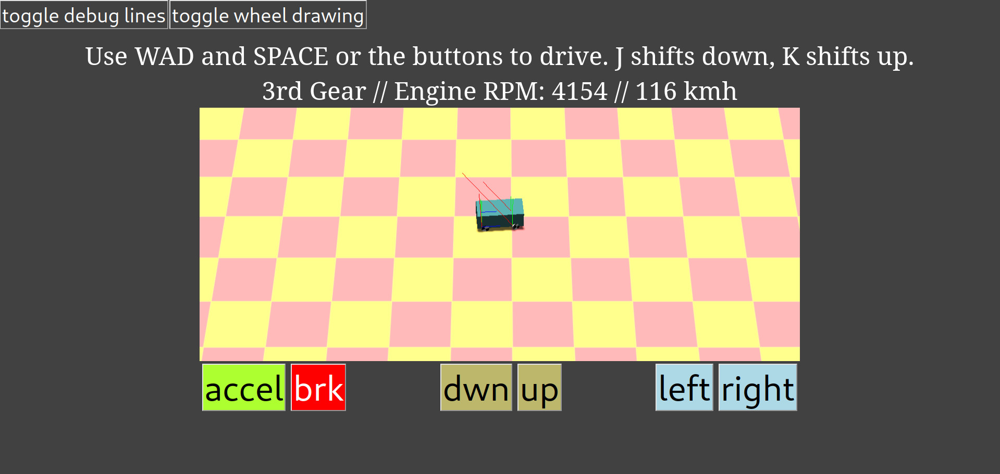

# Car Playground

An online environment to create and test accurately-simulated vehicles.

Currently implements semi-realistic tire modelling using the Pacejka Magic Formula, engine RPM / torque and gearing, angular velocity / wheel slip and locking.

To-do:
  - Improve UI
  - Add particle effects for wheel slip / lock
  - Add SFX
  - Add a real playground :)

In active development with [three.js](https://github.com/mrdoob/three.js/) and [cannon-es](https://github.com/pmndrs/cannon-es).

Available to play online now at [https://helpvisa.github.io/car-playground/](https://helpvisa.github.io/car-playground/)!

